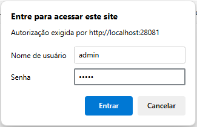

<p align="center" width="100%">
     
</p>


<h3 align="center">
  Desafio Backend do PicPay
</h3>

<p align="center">

  
  
  

</p>

Resolução do desafio proposto pelo repositório Backend Brasil, confira detalhes [neste link](https://github.com/backend-br/desafios/blob/master/url-shortener/PROBLEM.md).


# Sumário

+ [1 - Tecnologias utilizadas](#tecnologias-utilizadas)
+ [2 - Entenda o desafio](#entenda-o-desafio)
+ [3 - Como interagir com o banco de dados?](#como-interagir-com-o-banco-de-dados)
+ [4 - Como interagir com a API?](#como-interagir-com-a-api)
+ [5 - Desenvolvimento](#desenvolvimento)
+ [6 - Construção](#construção)
+ [7 - Contribuições](#contribuições)
+ [8 - Links](#links)
+ [9 - Adendo](#adendo)
+ [10 - Exemplos de Uso](#exemplos)


## Tecnologias utilizadas

* Java 21
* Spring Boot
* Spring Data MongoDB
* MongoDB
* Docker

## Entenda o desafio

Leio o [readme](PROBLEM.md) do problema.

## Como interagir com o banco de dados?
- Utilizamos o [MongoDB](https://www.mongodb.com/) + [Mongo Express](https://github.com/mongo-express/mongo-express?tab=readme-ov-file)

Acesse a pasta docker, abra o prompt e digite o comando:

```
docker-compose up -d
```

Irá subir o banco de dados mongo + mongo express.
Para acessar o mongo express, acesse: http://localhost:28081/

usuário e senha: admin




## Como interagir com a API?
- Utilizamos o [Postman](https://www.postman.com/) - para realizar as requisições.

## Desenvolvimento

Para iniciar o desenvolvimento, é necessário clonar o projeto do GitHub num diretório de sua preferência:

```shell
cd "diretorio de sua preferencia"
git clone https://github.com/erichiroshi/desafio-backend-url-shortener
```

## Construção

Para construir o projeto com o Maven, executar os comando abaixo:

```shell
mvn clean install
ou
.\mvnw clean install 
```

O comando irá baixar todas as dependências do projeto e criar um diretório *target* com os artefatos construídos, que incluem o arquivo jar do projeto. Além disso, serão executados os testes unitários, e se algum falhar, o Maven exibirá essa informação no console.

## Contribuições

Contribuições são sempre bem-vindas! Para contribuir lembre-se sempre de adicionar testes unitários para as novas classes com a devida documentação.

## Links
[Link do desafio](https://github.com/backend-br/desafios/blob/master/url-shortener/PROBLEM.md).

## Adendo
Para fins didáticos, a url gerada fica ativa por 1 minuto.
Para alterar a duração, na linha 40, da classe UrlController, modifique o método plusMinutes(1) para a quantidade de tempo desejada.

```
urlRepository.save(new UrlEntity(id, request.url(), LocalDateTime.now().plusMinutes(1)));
```

## Exemplos

### 1 - Encurtar url 
Para encurtar uma url faça [POST] localhost:8080/shorten-url. No body da requisição:

Campo | Tipo | Descrição |	Obrigatório |
--- | --- | --- | --- |
url |	String |	Endereço da url que será encurtado	| Sim


Requisição:

[POST] localhost:8080/points
```
{
    "url": "https://github.com/erichiroshi/desafio-backend-url-shortener"
}
```

Resposta:

200 OK

```
{
    "url": "http://localhost:8080/pNm9ZRB"
}
```

### 2 - Utilizar url encurtada

Requisição:

[GET] http://localhost:8080/pNm9ZRB

Resposta:

200 OK


## Developed by Eric Hiroshi
